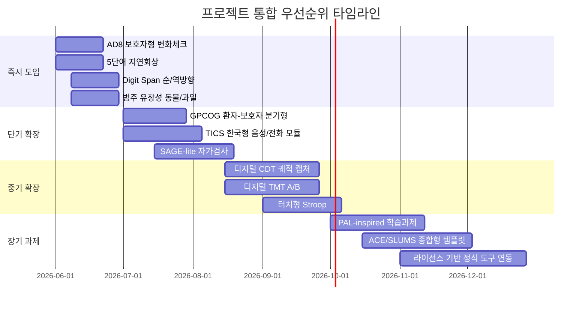

# 치매 예방 및 조기 징후 포착용 검증된 인지 선별검사와 신경심리 과제의 프로젝트 통합 보고서

## Executive summary

귀하의 프로젝트 저장소를 확인한 결과, 현재 `saerok-memory`는 객관식 의미 선택, 상황 매칭, 짝 맞추기, 순서 배열, 오디오 선택, 그림 선택, 개인 기억 회상, 지연 단어 회상, 주의 패턴, 도형 따라 그리기, 말 따라하기 같은 상호작용을 이미 지원하고 있습니다. 즉, **지연회상·주의·언어·그리기·음성 반복** 계열의 선별 과제를 추가하기에 매우 유리한 구조입니다. 반대로, **정식 MMSE/MoCA/ACE-III 전체 복제**처럼 라이선스·표준화·임상 해석 부담이 큰 도구는 그대로 넣기보다, 핵심 하위 과제를 **영감(inspired-by) 방식으로 분해**해 도입하는 편이 현실적입니다. citeturn9view0turn10view0turn26search1turn20view0turn22view0

프로젝트 관점에서 가장 먼저 넣을 가치가 큰 것은 **AD8, 5-word delayed recall, Digit Span backward, category verbal fluency, GPCOG의 informant 흐름, TICS식 비대면 모듈**입니다. 이들은 짧고, 자동채점이 쉽고, 고비용 라이선스 이슈가 상대적으로 작거나 우회 가능하며, 조기 변화 포착에 실무적으로 강합니다. 반면 **BNT, CVLT, CANTAB, 정식 MMSE/MoCA**는 검증력은 높지만, 저작권·시행 표준화·언어/교육 수준 보정 때문에 제품 통합 난이도가 높습니다. citeturn20view1turn25search1turn24search2turn30search10turn29search5turn17search3turn26search1turn18search1turn15search26

검사 선택의 핵심은 “무엇이 유명한가”보다 “**우리 제품에서 안정적으로 자동화할 수 있는가**”입니다. 조기 인지저하를 잘 잡는 도구일수록 대체로 **지연회상, 의미유창성, set-shifting, informant-based 변화 보고, 디지털 펜/터치 궤적**이 중요합니다. 따라서 제품 전략은 **짧은 다영역 스크리너 + 도메인별 미세 과제 + 가족/보호자 입력 + 반복 가능한 디지털 마커**의 4축으로 가는 것이 가장 타당합니다. citeturn27search4turn17search28turn16search11turn24search2turn32search15turn32search3

## 프로젝트 적합성 및 평가 프레임

현재 저장소 코드상 이미 구현된 exercise type은 `multiple_choice_meaning`, `situation_match`, `pair_matching`, `sequence_order`, `audio_choice`, `picture_choice`, `personal_memory_recall`, `delayed_word_recall`, `attention_pattern`, `shape_copy_practice`, `speech_repeat_practice`입니다. 이는 곧 프로젝트가 **선택형·회상형·도형형·음성형·지연형** 모달리티를 이미 갖추고 있다는 뜻입니다. 즉, 치매 조기 선별 분야에서 중요한 **지연회상, 숫자따라하기, 유창성, 시계그리기, 간단한 실행기능 과제**를 무리 없이 흡수할 수 있습니다. citeturn9view0turn10view0

이 보고서의 우선순위와 구현 난이도 평가는 사용자가 지정한 기준인 **문항 수, 응답 유형, 자동채점 가능성, 저작권, 언어의존성, 검증 연령대**를 따랐습니다. 여기에 현재 저장소가 갖고 있는 입력 모달리티를 추가로 반영했습니다. 즉, **이미 있는 입력 방식으로 구현 가능한가**를 가장 실무적인 판단 축으로 두었습니다. citeturn9view0turn10view0turn20view0turn20view1turn22view1turn34view1

아래 표는 프로젝트에 이미 있는 입력 자산을 치매 조기선별 과제군과 매핑한 것입니다.

| 현재 저장소의 상호작용 자산 | 바로 연결 가능한 검사항목 | 제품적 의미 |
|---|---|---|
| delayed_word_recall | 5-word delayed recall, MoCA/SLUMS/MMSE의 지연회상 하위문항, 이름-주소 회상 | 가장 먼저 확장해야 할 핵심 기억 마커 |
| attention_pattern | Serial 7s, vigilance/tap, 단순 sustained attention | 자동채점이 쉽고 반복측정에 유리 |
| shape_copy_practice | CDT, 오각형 복사, 큐브/도형 복사 | 시공간+집행 기능으로 확장 가능 |
| speech_repeat_practice | 문장 반복, digit span 음성응답, TICS/T-MoCA형 전화형 과제 | 비대면/고령층 접근성에 유리 |
| picture_choice / audio_choice | BNT short-form inspired naming, 의미-그림 연결, 범주 판단 | 언어/의미기억 과제의 저비용 버전 가능 |
| sequence_order / pair_matching | TMT-lite, alternation rules, paired-associate learning inspired tasks | 실행기능·신학습 과제로 확장 가능 |

이 매핑을 기준으로 보면, **정식 검사의 껍데기를 그대로 옮기는 것보다 하위인지기능을 프로젝트 친화형 과제로 재구성하는 전략**이 훨씬 효율적입니다. 이는 특히 저작권이 걸린 MMSE, CVLT, BNT, CANTAB에 중요합니다. citeturn26search1turn18search1turn28search10turn15search26turn9view0turn10view0

## 전반 선별검사

아래 표는 임상·일차의료·원격 환경에서 널리 쓰이는 전반 인지 스크리너를 프로젝트 통합 관점으로 정리한 것입니다.

| 테스트명 | 목적 | 구성 | 소요시간 | 점수체계·컷오프 | 공개 원문·PDF 링크 | 오픈소스 구현 링크 | 주요 검증 논문 및 요약 | 장단점 | 통합 판단 |
|---|---|---|---|---|---|---|---|---|---|
| **MMSE** | 전반적 인지기능, 지남력, 등록, 주의/계산, 회상, 언어, 간단한 시공간 | 전형적으로 30점, orientation 10점, registration 3점, attention/calculation 5점, recall 3점, language/commands/copying 9점 | 대개 5–10분 | 0–30점. 전통적으로 **23/24 이하**를 인지저하 시사로 많이 사용하나 교육·언어·연령 영향 큼 | [공식 PAR](https://www.parinc.com/products/MMSE) · [원저 PubMed](https://pubmed.ncbi.nlm.nih.gov/1202204/) · [비공식 교육용 PDF](https://cgatoolkit.ca/Uploads/ContentDocuments/MMSE.pdf) | 대표적 공개 구현은 있으나 임상 검증·저작권 면에서 비권장: [COBsquare/Dementia-Examiner-for-Individuals](https://github.com/COBsquare/Dementia-Examiner-for-Individuals) | 원저는 1975년 발표. 이후 광범위하게 쓰였지만 MCI에는 민감도가 낮고, Cochrane 리뷰들도 **조기 단계 단독 선별용으로 한계**를 지적합니다. MMSE는 여전히 표준 비교축으로 유용하지만, 조기 징후 탐지에는 MoCA·지연회상·유창성 과제가 더 낫다는 흐름이 강합니다. citeturn26search0turn26search6turn26search19turn26search26turn26search17 | 장점은 임상 친숙도와 비교가능성. 단점은 **MCI 민감도, 교육/문화 편향, 저작권** | **난이도 높음 / 우선순위 중간 이하.** 정식 MMSE 복제는 비권장. 대신 **serial 7s, 3-word recall, pentagon copy inspired task**만 차용 권장 |
| **MoCA** | MCI 및 초기 치매에 더 민감한 다영역 스크리너 | trail/visuospatial, cube, clock, naming, digit span, vigilance, serial 7s, sentence repetition, fluency, abstraction, delayed recall 5단어, orientation | 약 10분 | 0–30점. 통상 **26점 미만**이 양성 기준으로 널리 쓰이며, 일부 버전은 **교육 ≤12년 +1점 보정**을 둠 | [공식](https://mocacognition.com/) · [원저 PubMed](https://pubmed.ncbi.nlm.nih.gov/15817019/) · [개념 리뷰 PDF](https://www.concordia.ca/content/dam/artsci/research/caplab/docs/Julayanontetal2013MoCAreview.pdf) | 비임상/보조 코드만 확인: [Longitudinal-MoCA](https://github.com/bjoernhandersson/Longitudinal-MoCA) · [triforce4392/MoCA](https://github.com/triforce4392/MoCA) | 원저에서 MCI 탐지 민감도 **90%**, MMSE는 **18%**로 보고됐습니다. 2024 메타분석은 aMCI 탐지에 MoCA의 전반적 정확도가 좋다고 정리했고, Cochrane는 **<26 cut-off가 민감도는 높지만 위양성이 많다**고 요약했습니다. 한국 저학력 집단에서는 MoCA와 MMSE의 차별력이 생각보다 크지 않을 수 있어 **교육보정·현지 규준**이 중요합니다. citeturn27search2turn20view0turn27search4turn27search30turn27search35 | 장점은 조기 인지저하 민감도. 단점은 교육·언어 영향, 공식 배포 체계 의존, 그림/언어 문항 복합성 | **난이도 높음 / 우선순위 중간.** 정식 전량 복제보다 **clock + delayed recall + fluency + abstraction 하위과제 분해 도입** 권장 |
| **AD8** | 정상 노화와 초기 치매를 구분하는 **informant/self change screener** | 기억·지남력·판단·기능 변화를 묻는 8문항 예/아니오/모름 | 평균 3분 | 0–8점, **0–1 정상 / 2 이상 인지장애 시사** | [공식](https://knightadrc.wustl.edu/professionals-clinicians/ad8-instrument/) · [원저 PubMed](https://pubmed.ncbi.nlm.nih.gov/16116116/) | 신뢰할 만한 공개 구현은 이번 조사에서 확인하지 못함 | 공식 페이지 기준 **민감도 >84%, 특이도 >80%**, CDR와 상관이 높습니다. 2023 체계적 검토는 informant AD8가 patient/self AD8보다 낫다고 정리했고, 2025 재평가 연구는 **self-admin AD8는 false positive가 높을 수 있어 cut-off 재검토가 필요**하다고 제안했습니다. citeturn20view1turn11search10turn25search3turn25search26 | 장점은 매우 짧고, 환자 수행능력보다 **변화 인식**을 잡는다는 점. 단점은 informant 부재 시 성능 저하 가능성 | **난이도 낮음 / 우선순위 매우 높음.** 모바일·보호자용 별도 플로우로 즉시 추가 권장 |
| **GPCOG** | 일차의료용 인지 스크리너. 환자 과제 + 보호자 인터뷰 결합 | 환자 파트: 이름·주소 기억, 날짜, 시계 숫자/바늘, 최근 뉴스, 지연회상 / 필요 시 informant interview 추가 | 대개 5분 내외 + 보호자 1–2분 | 환자 파트 9점. **9점 정상, 5–8점은 informant interview 필요, 0–4점은 인지장애 시사** | [공식](https://gpcog.com.au/) · [영문 PDF](https://gpcog.com.au/uploads/ckfinder/userfiles/files/English.pdf) · [원저 PDF](https://gpcog.com.au/uploads/ckfinder/userfiles/files/Brodaty2002%20The%20GPCOG.pdf) | 이번 조사에서 대표적 공개 구현은 확인하지 못함 | 원저에서 **민감도 85%, 특이도 86%**로 보고됐고, 후속 연구들은 저학력 집단에서 기능 문항 결합의 장점을 강조했습니다. 공식 사이트는 한국어 번역을 포함한 다국어 자료를 제공합니다. citeturn25search1turn25search20turn20view2turn12search2turn25search12 | 장점은 primary care 친화성, 보호자 정보 결합, 다국어 자료. 단점은 시계그리기와 최근 뉴스 문항의 문화·시사성 영향 | **난이도 낮음~중간 / 우선순위 높음.** 환자-보호자 분기형 UX로 매우 적합 |
| **SAGE** | 자가작성형 MCI/초기 치매 스크리너 | 날짜, 그림 이름대기, 유사성, 계산, 기억지시, 3D 도형 복사, 시계, 동물 유창성, modified trails, 문제해결, 지연회상 | 평균 15분 | 0–22점, **17점 이상 정상** | [공식 소개](https://wexnermedical.osu.edu/brain-spine-neuro/memory-disorders/sage) · [Form PDF](https://wexnermedical.osu.edu/-/media/files/wexnermedical/patient-care/healthcare-services/brain-spine-neuro/memory-disorders/sage/us/sage_form1_us_2021.pdf?hash=A86118A320EC3A29BAC15B8D299392CA&rev=e74c7aa83b7e40c5b4570293a2221b41) · [Scoring PDF](https://wexnermedical.osu.edu/-/media/files/wexnermedical/patient-care/healthcare-services/brain-spine-neuro/memory-disorders/sage/us/sage_scoringinstructions_usuk_2021.pdf?hash=43974E719E562B76BD768DC8ECBE4EF3&rev=8d285147c07e4464816b5a06d24033f2) · [원저 PubMed](https://pubmed.ncbi.nlm.nih.gov/20220323/) | 디지털화 연구는 있으나 완성도 높은 공개 OSS는 미확인 | 원저는 SAGE가 MMSE와 비교해 양호한 스크리닝 성능을 보였다고 보고했고, eSAGE 연구는 종이판과 강한 연관을 보였습니다. 2021 종단 연구에서는 **SAGE가 MMSE보다 적어도 6개월 먼저 전환을 감지**했다고 보고했습니다. citeturn21view0turn21view1turn25search8turn32search1turn25search11 | 장점은 자가시행, 다영역, 추적관찰 친화성. 단점은 literacy·시각·운동 기능 의존 | **난이도 중간 / 우선순위 높음.** 프로젝트에 가장 잘 맞는 “자기주도형 종합 검사” 템플릿 |
| **SLUMS** | 60세 이상 성인에서 MCI/치매 감지 | orientation, 5개 물건 기억, 계산, animal naming, digit span reverse, clock drawing, story recall 등 11문항 | 공식 페이지는 분 단위 미명시, 실무상 짧은 검사 | 0–30점. **고졸 이상: 27–30 정상, 21–26 MND, 1–20 dementia / 고졸 미만: 25–30 정상, 20–24 MND, 1–19 dementia** | [공식 페이지](https://www.slu.edu/medicine/internal-medicine/geriatric-medicine/aging-successfully/mental-status-exam.php) · [PDF](https://www.slu.edu/medicine/internal-medicine/geriatric-medicine/aging-successfully/-pdf/slums-form.pdf) | 대표적 공개 구현은 확인하지 못함 | 공식 설명은 60세 이상에서 연 1회 사용을 권장하고, 교육수준별 cutoff를 제공합니다. 다만 원격/전화 시행은 **정식 설계 대상이 아니며, drawing 문항 때문에 validity 검증이 필요**하다고 명시합니다. citeturn20view3turn13search1 | 장점은 무료, 교육보정 cutoff, 임상 이해 쉬움. 단점은 story recall/clock scoring 자동화 필요, 원격 타당화 부족 | **난이도 중간 / 우선순위 중간 이상.** 정식 복제보다 **하위과제 모듈화**가 적합 |
| **TICS / TICS-M** | 전화 기반 전반 인지 스크리너 | 이름·날짜·주소, backward counting, 10-word immediate/delayed recall, serial 7s, 지식/명명/반복/반의어, tapping 등 | 보통 10분 미만 | TICS는 **0–51점**. 단일 cutoff는 연구별 상이. TICS-M 연구에서는 **34점**이 aMCI 선별 cutoff로 제시된 바 있음 | [NIA/LIFE TICS PDF](https://agingresearchbiobank.nia.nih.gov/studies/life/documents/download/Forms_Main_Trial/F030_Telephone_Interview_for_Cognitive_Status%28TICS%29_v1.0.pdf/) · [원저 정보](https://pure.johnshopkins.edu/en/publications/the-telephone-interview-for-cognitive-status-3/) | 대표적 공개 구현은 이번 조사에서 확인하지 못함 | TICS는 시각·운동 제한이 있는 사람에게 유리하고, 전화형 스크리닝 메타분석에서도 유용성이 확인됐습니다. 2009 aMCI 연구는 TICS-M 단독 분류 정확도 **85.9%**, 민감도 **82.4%**, 특이도 **87.0%**를 보고했습니다. 한국 노인 집단에서도 TICS/TICSm 타당화 연구가 있습니다. 다만 **대통령/부통령 문항 같은 문화특이 문항은 현지화 필수**입니다. citeturn34view1turn24search8turn24search2turn24search26turn24search1turn24search19 | 장점은 비대면·전화 친화성. 단점은 문화고유 문항과 원격 청력 이슈 | **난이도 낮음~중간 / 우선순위 매우 높음.** 한국형 “전화/음성형 리모트 패스웨이”에 최적 |
| **ACE-R / ACE-III** | 전반 인지 + 도메인별 프로파일링. 치매 subtype 감별에도 유용 | attention, memory, verbal fluency, language, visuospatial. ACE-III는 ACE-R의 후속판 | ACE-III 평균 15분, 채점 5분 | 0–100점. ACE-III는 문헌에서 **88/100, 82/100** 같은 cutoff가 널리 쓰임 | [공식 페이지](https://www.sydney.edu.au/brain-mind/our-clinics/dementia-test.html) · [ACE-III guide PDF](https://www.sydney.edu.au/content/dam/corporate/documents/brain-and-mind-centre/june19/ACE-III%20ScoringUK2017.pdf) · [ACE-III 원저 PubMed](https://pubmed.ncbi.nlm.nih.gov/23949210/) · [ACE-R 원저 PubMed](https://pubmed.ncbi.nlm.nih.gov/16977673/) | 대표적 공개 구현은 확인하지 못함 | University of Sydney는 **무료 다운로드, 다국어 번역, 한국어 버전, 원격 시행 가이드**를 제공합니다. 2023 메타분석은 ACE(ACE-R/ACE-III)가 비교된 brief screeners 중 가장 높은 진단 타당도를 보였다고 보고했습니다. citeturn22view0turn22view1turn23search1turn23search9turn23search2 | 장점은 폭넓은 도메인, 치매 subtype 감별, 공식 번역 및 remote guide. 단점은 길이와 언어의존성 | **난이도 높음 / 우선순위 중간.** 정식 배포는 가능하나 제품 UX로는 **SAGE-lite/ACE-inspired 모듈화**가 더 현실적 |

전반 스크리너만 놓고 보면, **제품 친화성**은 AD8 → TICS/GPCOG → SAGE → SLUMS/ACE-III → MoCA/MMSE 순으로 보는 것이 타당합니다. 이 순서는 검사의 우열이 아니라 **제품에서 자동화하기 쉬운 정도**와 **라이선스 리스크**를 함께 반영한 결과입니다. citeturn20view1turn25search1turn21view1turn34view1turn22view0turn26search1

## 도메인별 신경심리 검사

아래 표는 사용자가 명시한 도메인형 과제를 프로젝트 통합 관점으로 정리한 것입니다.

| 테스트명 | 목적 | 구성 | 소요시간 | 점수체계·컷오프 | 공개 원문·PDF 링크 | 오픈소스 구현 링크 | 주요 검증 논문 및 요약 | 장단점 | 통합 판단 |
|---|---|---|---|---|---|---|---|---|---|
| **CDT 시계그리기** | 시공간, 실행기능, 계획, 개념적 시간표현 | 보통 “11시 10분 시계를 그리라”는 command, 때로는 copy 조건 포함 | 보통 1–3분 | Shulman, Sunderland, Mendez, Rouleau, Freedman 등 **여러 scoring 체계**가 있어 단일 cutoff 없음 | [체계적 리뷰·메타 PubMed](https://pubmed.ncbi.nlm.nih.gov/30047147/) · [역사적 리뷰 PMC](https://pmc.ncbi.nlm.nih.gov/articles/PMC5619209/) | [noc-lab/CDT](https://github.com/noc-lab/CDT) · [COBsquare/Digital-Recognition-and-Evaluation-of-the-Clock-Drawing-Test](https://github.com/COBsquare/Digital-Recognition-and-Evaluation-of-the-Clock-Drawing-Test) · [trebledawson/Alzheimers-Clock-Drawing](https://github.com/trebledawson/Alzheimers-Clock-Drawing) | 2018 메타분석은 CDT가 dementia screening에는 유용하지만 scoring system에 따라 편차가 크다고 정리했습니다. 국내 연구도 **MCI보다 mild dementia에서 더 유용**함을 보여줍니다. 최근 디지털 버전은 단순 score보다 **획 순서·멈춤·latency**가 더 유용할 수 있음을 보여줍니다. citeturn16search0turn28search33turn16search36turn14search7turn32search15turn32search23 | 장점은 짧고 직관적. 단점은 자동채점 없으면 주관성, MCI 단독 선별력 제한 | **난이도 중간~높음 / 우선순위 높음.** `shape_copy_practice`를 확장해 **펜 궤적 기반 dCDT**로 가는 것이 최선 |
| **Trail Making Test A/B** | A는 시각탐색·처리속도, B는 set-shifting·집행기능 | A: 숫자 1–25 연결. B: 1-A-2-B 교대 연결 | 대개 5–10분 | 시간·오류가 핵심. **보편 단일 cutoff보다 연령/교육 보정 규준**이 중요 | [TMT 해석 프로토콜](https://www.researchgate.net/publication/6416422_Administration_and_interpretation_of_Trail_Making_Test) · [규준 PDF](https://www.ianindia.org/uploads/files/TMT.norms.pdf) | [GEJ1/jsPsych_online_TMT](https://github.com/GEJ1/jsPsych_online_TMT) · [med-material/Trail-it](https://github.com/med-material/Trail-it) · [NeuroLIAA/tmt-analysis](https://github.com/NeuroLIAA/tmt-analysis) · [dcajal/cognitive-tests](https://github.com/dcajal/cognitive-tests) | TMT는 노화·MCI·치매 사이에서 시간과 오류 패턴이 달라지고, 최근에는 eye/hand tracking을 결합한 디지털 버전이 세밀한 구분에 유망합니다. citeturn16search5turn16search9turn28search4turn19search3turn19search23turn16search33 | 장점은 짧고 집행기능 민감. 단점은 motor/vision 의존, 고령층 조작 부담 | **난이도 중간 / 우선순위 높음.** 스마트폰에서는 손가락 궤적과 hesitation time을 함께 저장해야 가치가 큼 |
| **Digit Span 순·역방향** | 주의집중, 단기기억, working memory | 검사자가 숫자열을 읽고 같은 순서·역순으로 반복. WAIS는 sequencing도 포함 | 대개 3–5분 | 최대 span, raw correct 수. **치매용 보편 cutoff 없음** | [WAIS-IV 공식](https://www.pearsonassessments.com/en-us/Store/Professional-Assessments/Cognition-%26-Neuro/Wechsler-Adult-Intelligence-Scale-%7C-Fourth-Edition/p/100000392) | generic 구현 가능: [dcajal/cognitive-tests](https://github.com/dcajal/cognitive-tests) | MCI와 AD 모두 controls보다 못하며, 특히 backward가 더 민감한 경향이 있습니다. 디지털화했을 때 반응시간·실수 패턴으로 분류력이 약간 더 좋아질 가능성도 제시됐습니다. 교육·연령 영향은 반드시 고려해야 합니다. citeturn30search10turn30search7turn30search5turn30search3turn30search8 | 장점은 짧고 자동채점 쉬움. 단점은 exact 표준화는 WAIS 저작권 | **난이도 낮음 / 우선순위 매우 높음.** 정식 WAIS 복제가 아니라 **generic digit-span**으로 구현 권장 |
| **Verbal Fluency 카테고리·음운** | 의미기억, lexicon 탐색, 집행기능 | 60초 동안 동물 이름(semantic) 또는 F/A/S 같은 글자로 시작하는 단어 생성(phonemic) | 항목당 1분 | 정답 개수, 반복·고유명사 제외. **언어·교육·문화 의존성이 매우 큼** | [개념적 원류 참고](https://link.springer.com/rwe/10.1007/978-0-387-79948-3_1423) · [screening review PMC](https://pmc.ncbi.nlm.nih.gov/articles/PMC9153280/) | 이번 조사에서 전용 임상 OSS는 미확인. 음성 기록은 일반 STT로 구현 가능 | 2019 리뷰는 특히 **semantic fluency가 time-limited setting에서 early dementia screening에 적합**하다고 정리했습니다. 한국 DND 연구도 **category fluency가 MCI/AD 분리에 가장 좋은 specificity·sensitivity**를 보인다고 보고했습니다. citeturn16search11turn29search5turn29search1turn29search13 | 장점은 1분 과제로 강력. 단점은 언어별 norm 없이는 오판 위험 | **난이도 낮음 / 우선순위 매우 높음.** 한국어에서는 **동물/과일/슈퍼마켓 품목** 등 범주형부터 시작 권장 |
| **RAVLT / CVLT** | 에피소드 언어기억, 학습곡선, 간섭, 지연회상, 재인 | 15–16단어 목록을 여러 trial에 걸쳐 학습, interference list, 즉시/지연회상, recognition | 대개 20–30분 | 총 학습량, 지연회상, recognition, intrusion, learning slope 등 다변량. **단일 cutoff보다 규준 기반 해석** | [RAVLT 공식 WPS/PAR](https://www.parinc.com/products/RAVLT) · [CVLT-3 공식 Pearson](https://www.pearsonclinical.co.uk/en-gb/cvlt-ii/California-Verbal-Learning-Test-%7C-Third-Edition/p/P100009129) | 직접적인 검증된 OSS는 이번 조사에서 확인 못함. 유사 과제용 예시는 [bc-bytes/cognitive-tests](https://github.com/bc-bytes/cognitive-tests) | 연구 전반에서 **지연회상 지표**가 MCI→AD 전환 예측에 특히 강하다는 점이 반복 확인됩니다. CVLT-II total learning, RAVLT delayed recall 등은 조기 변화 포착에 매우 민감합니다. 다만 정식 자극어와 규준은 상용판에 의존하는 경우가 많습니다. citeturn17search4turn17search28turn29search10turn29search18turn18search0turn18search1 | 장점은 기억 프로파일링이 매우 풍부. 단점은 길고, 상용 판권 의존 | **난이도 높음 / 우선순위 중간 이하.** 프로젝트에는 **short word-list learning inspired task**로 축약하는 편이 현실적 |
| **Boston Naming Test** | confrontation naming, 언어/의미기억 | 60개 그림 이름대기, 필요 시 semantic/phonemic cue | 공식상 35–45분 | spontaneous correct, cue benefit, short form 사용 가능. **언어·문화 친숙도 영향 큼** | [공식 PRO-ED](https://proedinc.com/products-11870.html) · [Pearson distributor](https://pearson.my.site.com/usclinical/s/article/BNT-Administration-Scoring-and-Normative-Data-Request) | 검증된 공개 구현은 이번 조사에서 미확인 | naming deficits는 aMCI에서도 보일 수 있고, 일부 연구는 naming impairment가 전환 위험 증가와 관련된다고 보고합니다. 하지만 그림 친숙도와 문화번역 이슈가 커서 **현지화 비용이 높습니다**. citeturn28search10turn17search17turn17search1turn17search33 | 장점은 언어 영역에 특화. 단점은 길고 그림저작권/문화적 편향 | **난이도 높음 / 우선순위 낮음.** 프로젝트에는 **10–15개 short-form inspired picture naming**만 권장 |
| **Stroop Test** | 억제, 선택적 주의, 처리속도, 인지 유연성 | 단어읽기/색이름대기/불일치 color-word, 또는 switching variant | 보통 3–5분 내외, 디지털판은 trial 수에 따라 가변 | 반응시간, 오류, interference score. **보편 cutoff 없음** | [개념 리뷰 PMC](https://pmc.ncbi.nlm.nih.gov/articles/PMC5388755/) · [공식 WPS](https://www.wpspublish.com/stroop-color-word-test-normative-update.html) | [expfactory-experiments/stroop-5min](https://github.com/expfactory-experiments/stroop-5min) · [flowersteam/cognitive-testbattery](https://github.com/flowersteam/cognitive-testbattery) | Stroop는 오랫동안 AD 관련 집행기능 평가에 사용돼 왔고, switching Stroop이나 VR Stroop 같은 변형은 초기 MCI에서 생태학적 타당도 개선 가능성을 보입니다. 다만 문해력과 색어휘 이해에 민감합니다. citeturn31search13turn31search24turn31search15turn31search7turn31search28 | 장점은 디지털화가 쉽고 reaction-time 활용 가능. 단점은 문해력·색각·음성 recognition 이슈 | **난이도 중간 / 우선순위 중간 이상.** 스마트폰 음성형보다 **터치형 forced-choice color Stroop**가 먼저 |
| **5-word delayed recall / Dubois FWT 계열** | 해마형 episodic memory, encoding–retrieval 구분 | 5개 범주단어를 의미단서와 함께 학습, 즉시/지연 자유회상, 필요 시 단서회상 | 2–5분 | FRS, TRS, TWS 등 사용. 연구에 따라 cutoff 다르나, 한 memory clinic 연구에서는 **TWS ≤15**가 dementia/AD 분리에 유용 | [타당화 논문](https://journals.sagepub.com/doi/10.1177/0891988712445088) · [이탈리아판 검증 PMC](https://pmc.ncbi.nlm.nih.gov/articles/PMC5632878/) · [2022 적응·검증](https://www.mdpi.com/2308-3417/7/2/49) | 전용 OSS는 미확인. 구현은 매우 쉬움 | 2012 유효성 연구는 FWT가 verbal episodic memory를 잘 반영하며 AD 구분에 유용하다고 보고했고, 한 연구에서는 **TWS ≤15에서 민감도 75%, 특이도 95.9%**를 보고했습니다. 짧고 cueing이 가능해 모바일에 특히 적합합니다. citeturn17search15turn17search23turn17search19turn17search11 | 장점은 지연회상 기반의 짧은 검사. 단점은 단어 세트와 범주 설계에 문화적 검토 필요 | **난이도 낮음 / 우선순위 매우 높음.** 현재 프로젝트의 `delayed_word_recall`과 가장 자연스럽게 결합 |
| **CANTAB 주요 모듈** | 정밀 디지털 인지평가. 조기 변화, 약물효과, 반복측정에 강점 | **PAL**(visual memory/new learning), **SWM**(spatial working memory/strategy), **RVP**(sustained attention), **RTI**(processing speed), **PRM/DMS**(recognition memory), **OTS/SOC**(planning), **MOT**(motor screening) | 모듈별 가변. 예: **PAL 약 8분**, CANTAB Insight는 **20–25분** | 자동채점. 오류, latency, 전략지표, RT 기반. **공개 보편 cutoff 없음** | [공식 CANTAB overview](https://cambridgecognition.com/digital-cognitive-assessments/) · [PAL 공식](https://cambridgecognition.com/paired-associates-learning-pal/) · [Alzheimer’s 배터리 설명](https://cambridgecognition.com/alzheimers/) | 공개 구현은 아닌 상용 플랫폼. 유사 오픈소스 예시는 [bc-bytes/cognitive-tests](https://github.com/bc-bytes/cognitive-tests) | Cambridge Cognition은 CANTAB이 **3,000편 이상 출판물**에서 검증됐다고 밝히며, PAL/SWM가 aMCI 기능저하 예측에 중요하다고 소개합니다. 연구문헌도 CANTAB이 MCI와 AD를 구분하는 데 유용하다고 보고합니다. 장점은 **언어독립성과 자동채점**, 단점은 상용 솔루션이라는 점입니다. citeturn15search26turn33view0turn15search18turn14search6turn14search14turn30search21 | 장점은 디지털 정밀도, 반복측정, cross-cultural 강점. 단점은 상용 비용과 통합 제약 | **난이도 매우 높음 / 우선순위는 파트너십 전제.** 직접 복제보다 **PAL-inspired, SWM-inspired microtask** 개발 권장 |

이 섹션의 핵심은 명확합니다. **프로젝트에 당장 힘이 되는 것은 Digit Span, verbal fluency, 5-word delayed recall, TMT-lite, dCDT**이고, **RAVLT/CVLT/BNT/CANTAB**은 그대로 넣기보다 개념만 추출해 경량 과제로 재설계해야 합니다. citeturn30search10turn29search5turn17search15turn19search3turn32search15turn18search1turn28search10turn15search26

## 디지털 및 모바일 인지평가

디지털·모바일 분야는 “종이검사를 태블릿으로 옮긴 것”과 “디지털에서만 얻을 수 있는 궤적·반응시간·중단시간 같은 새로운 바이오마커”를 구분해야 합니다. 후자가 조기 징후 포착에서 더 중요합니다. citeturn32search15turn32search3turn33view0

| 도구/방법론 | 무엇을 측정하는지 | 공개성 | 핵심 근거 | 프로젝트 적용 포인트 |
|---|---|---|---|---|
| **eSAGE** | 종이 SAGE를 태블릿으로 옮긴 self-admin screening | 연구 공개는 있으나 완성된 OSS는 미확인 | eSAGE는 paper SAGE 및 neuropsych battery와 강한 연관을 보였고, scale bias가 없다고 보고됨 citeturn32search1turn32search13 | 프로젝트의 **자가형 종합검사** 설계에 가장 직접적 참고모델 |
| **Digital Clock Drawing Test** | 결과 점수뿐 아니라 stroke order, latency, hesitation, graphomotor 특성 | 상용/연구 혼합. 일부 연구·데이터셋·코드 공개 | dCDT feature가 neuropsych test와 MCI에 유의하게 연관되고, 일부 연구는 conventional CDT보다 진단 가치가 높다고 보고 citeturn32search3turn32search15turn14search23 | `shape_copy_practice`를 **펜 궤적 기반 서명/획분석 모듈**로 확장하는 근거 |
| **NIH Toolbox Cognition Battery** | episodic memory, working memory, processing speed, executive function 등 다영역 태블릿 평가 | 공식 툴킷, 오픈소스 아님 | memory clinic setting 유효성이 보고됐고, 최근 연구는 NC/MCI/DAT 구분 가능성을 지지 citeturn32search30turn32search2turn32search10 | **표준화된 디지털 battery UX**와 composite score 설계 참고용 |
| **연구용 모바일 DACI류** | 원격 모바일 기반 인지저하 탐지, ML 활용 | 연구 단계, 공개 도구 제한적 | 2025 연구는 compact mobile battery로 screening time을 줄이면서 분류 성능 유지 가능성을 제시 citeturn32search12 | 제품 장기 로드맵에서 **짧은 멀티태스크 + latent marker** 조합 참고 |
| **오픈소스 인지과제 프레임워크** | Stroop/TMT/attention/memory generic task 구현 | 공개 | `flowersteam/cognitive-testbattery`, `dcajal/cognitive-tests`, `jsPsych_online_TMT`, `cognition_package`, `stroop-5min` 등은 연구용 구현 예시를 제공하지만 임상 검증된 제품이 아님 citeturn31search26turn19search19turn19search3turn19search5turn31search16 | **프로토타입 제작 속도는 높여주지만**, 임상 선별 도구로 바로 쓰면 안 됨 |
| **모바일/스마트홈/웨어러블 통합 평가** | 인지과제 외 일상행동·사용패턴 기반의 지속 측정 | 대부분 연구 단계 | 2025 systematic review는 가능성을 인정하지만 **이질성·표준화 부족**을 지적 citeturn32search0 | 앱 안에서 **반응시간, 중단시간, 반복 오류, 과제 회피** 같은 passive marker를 함께 저장하는 방향이 적합 |

디지털 방법론에서 가장 중요한 것은 **“총점 1개”보다 “행동 데이터의 시계열”**입니다. 특히 dCDT, digital TMT, Stroop, PAL 계열은 손가락/펜 궤적, 반응잠복시간, self-correction, hesitation 같은 데이터가 오히려 조기 변화를 더 잘 잡을 수 있습니다. citeturn32search15turn19search23turn31search15turn15search18

## 우리 프로젝트용 권장 통합 로드맵

아래 로드맵은 현재 저장소의 입력 모달리티, 각 검사의 저작권/자동채점 가능성, 그리고 실제 조기인지저하 탐지에 대한 문헌 근거를 바탕으로 한 **제품 설계 추론**입니다. 즉, 임상 가이드라인 그 자체가 아니라 **구현 우선순위를 위한 엔지니어링 판단**입니다. citeturn9view0turn10view0turn20view1turn25search1turn30search10turn29search5turn17search15turn34view1turn32search15

권장 통합 항목을 더 압축하면 아래와 같습니다.

| 권장 항목 | 이유 | 구현 난이도 | 권장 우선순위 | 권장 변형 |
|---|---|---|---|---|
| **AD8 보호자 입력 플로우** | 3분, 자동채점, informant 기반이라 “실제 변화”를 잘 잡음 | 낮음 | 매우 높음 | 모바일 보호자 모드, 전화/카카오톡 링크형 |
| **5-word delayed recall** | 해마형 기억저하를 짧게 포착, 이미 delayed recall 자산 존재 | 낮음 | 매우 높음 | 음성·텍스트 병행, 범주 단서 제공 |
| **Digit Span backward** | working memory/집행기능에 민감, 자동채점 쉬움 | 낮음 | 매우 높음 | TTS 제시 + 음성 인식 또는 숫자버튼 입력 |
| **Category verbal fluency** | 60초 과제인데 조기 저하 탐지력이 좋음 | 낮음~중간 | 매우 높음 | STT 기반 자동 전사 + 반복/범주오류 체크 |
| **GPCOG 분기형** | 환자 + 보호자 정보 결합, 1차 의료용으로 적합 | 낮음~중간 | 높음 | 환자 self → 보호자 follow-up 자동 전환 |
| **TICS 한국형 원격판** | 전화/음성 모드에 적합, 시각·운동 제약 우회 | 낮음~중간 | 높음 | 한국 지식문항으로 교체, 청력 체크 포함 |
| **SAGE-lite** | 프로젝트 안에서 “자가형 종합검사”로 가장 매끄러움 | 중간 | 높음 | 모듈형 8–10분 버전, 결과 추세 비교 중심 |
| **dCDT** | 결과뿐 아니라 궤적·latency가 디지털 마커가 됨 | 중간~높음 | 높음 | 원과 숫자/바늘을 단계 분리하고 펜/터치 로그 저장 |
| **Digital TMT** | TMT-B는 set-shifting에 유용, 경로·머뭇거림 데이터 확보 가능 | 중간 | 중간 이상 | 손가락/스타일러스 경로 저장, 오류 자동 피드백 없음 |
| **정식 MMSE/MoCA/ACE full clone** | 유명하지만 라이선스·표준화·문화보정 부담이 큼 | 높음 | 중간 이하 | 가능하면 공식 라이선스 또는 하위과제 분해 도입 |
| **BNT/CVLT/CANTAB 직접 재현** | 검증력은 높지만 상용·복잡·현지화 비용 큼 | 높음 | 낮음 | long-range roadmap 또는 기관 파트너십 전제 |

실무적으로 가장 추천하는 MVP 묶음은 **AD8 + 5-word delayed recall + Digit Span backward + animal fluency + GPCOG informant branch**입니다. 이 다섯 개만으로도 기억, 주의/작업기억, semantic retrieval, 보호자 보고를 모두 덮을 수 있습니다. citeturn20view1turn17search15turn30search10turn29search5turn25search1

## 도메인별 추천 소규모 과제

아래 목록은 “정식 임상검사를 완전 재현”하려는 목적이 아니라, **프로젝트에서 반복측정 가능하고 자동화 가능한 소규모 과제 묶음**으로 재구성한 추천안입니다. 각 항목은 앞선 검사의 핵심 하위기능을 반영한 설계 제안입니다. citeturn9view0turn10view0turn20view1turn30search10turn29search5turn17search15turn32search15

| 영역 | 추천 과제 | 1줄 설명 |
|---|---|---|
| 인지 전반 | 오늘 날짜·요일·장소 묻기 | 지남력 저하를 가장 짧게 확인하는 기본 층 |
| 인지 전반 | 이름-주소 즉시/지연회상 | GPCOG·ACE류에서 반복적으로 쓰이는 간단한 기억+주의 과제 |
| 기억 | **5단어 지연회상** | 짧지만 해마형 기억저하를 잘 반영하는 핵심 과제 |
| 기억 | 10단어 리스트 즉시/지연회상 | RAVLT/CVLT inspired 경량판으로 학습곡선과 지연회상 모두 확인 |
| 기억 | 짝연합 기억 | 그림-단어, 소리-그림 등 pair learning으로 신학습 능력 확인 |
| 집중 | **Digit Span forward** | 단기기억/주의집중의 가장 간단한 측정 |
| 집중 | **Digit Span backward** | working memory와 mental manipulation을 더 잘 반영 |
| 집중 | Serial 7s | 정신 산술과 sustained attention을 동시에 확인 |
| 집중 | 탭 vigilance | 특정 음/숫자에만 반응하게 하는 단순 지속주의 과제 |
| 실행기능 | **TMT-B lite** | 숫자-문자 또는 숫자-색 교대 연결로 set-shifting 측정 |
| 실행기능 | **Category fluency** | 60초간 동물 이름 대기처럼 semantic search와 executive search를 함께 봄 |
| 실행기능 | **Stroop touch** | 의미를 무시하고 색만 선택하게 해 inhibition 측정 |
| 실행기능 | 규칙 전환 카드 | “같은 모양→다른 색”처럼 규칙을 바꾸는 mini set-shifting 과제 |
| 시공간 | **Clock drawing** | 원, 숫자, 바늘 배치를 한 번에 보는 고효율 시공간 과제 |
| 시공간 | 오각형/큐브 복사 | MoCA/MMSE/ACE류의 전형적 visuoconstruction 요소 |
| 시공간 | 겹친 도형 판별 | 시지각 분해와 공간 판단을 짧게 측정 |
| 언어 | short-form picture naming | BNT inspired 10–15 문항으로 naming difficulty를 경량 측정 |
| 언어 | 문장 반복 | TICS/MoCA 계열의 repetition 하위과제에 해당 |
| 언어 | 의미 연관 고르기 | 단어와 그림, 단어와 범주를 연결해 semantic integrity 확인 |
| 정서/행동 | 최근 흥미 저하/기분 저하 2문항 | 우울은 가성치매와 감별에 매우 중요하므로 보조수집 권장 |
| 정서/행동 | 성격 변화 체크 | SAGE·AD8처럼 최근 몇 년간 변화 여부를 짧게 파악 |
| 정서/행동 | 보호자 기능변화 체크 | 약 복용, 돈 관리, 약속 기억 등 IADL 변화 보고를 수집 |

이 중에서 프로젝트에 가장 먼저 올리기 좋은 “작은 과제 패키지”는 **5단어 지연회상 + Digit Span backward + 동물 유창성 + 날짜/요일 지남력 + 보호자 변화체크**입니다. 이 조합은 구현비용 대비 정보량이 매우 큽니다. citeturn17search15turn30search10turn29search5turn20view1

## 구현상 주의와 제한점

가장 중요한 주의점은 **스크리닝과 진단을 절대 혼동하지 않는 것**입니다. AD8 공식 페이지와 SLUMS 공식 페이지 모두 이들 도구가 **진단이 아니라 후속 평가가 필요한 선별**임을 분명히 밝힙니다. 따라서 프로젝트 UX도 “위험 신호 탐지”와 “전문의 평가 권유”를 기본 톤으로 설계해야 합니다. citeturn20view1turn20view3

두 번째는 **저작권과 공식 배포 체계**입니다. MMSE는 PAR의 공식 배포 구조가 있고, CVLT와 Digit Span은 Pearson, BNT는 PRO-ED/배포사, CANTAB은 Cambridge Cognition의 상용 플랫폼입니다. 즉, **정식 원문/자극물을 그대로 복제하는 전략은 리스크가 큽니다**. 반면 AD8, GPCOG, SAGE, SLUMS, ACE-III는 공식 다운로드 또는 공식 안내가 상대적으로 개방적입니다. citeturn26search1turn18search1turn28search10turn28search7turn15search26turn20view1turn20view2turn21view0turn20view3turn22view0

세 번째는 **언어·교육·문화 보정**입니다. MoCA는 교육보정 이슈가 크고, verbal fluency·BNT·TICS·GPCOG의 일부 문항은 언어/문화 특수성이 큽니다. 예를 들어 TICS의 미국 대통령/부통령 문항은 한국형 문항으로 교체해야 하며, verbal fluency는 영어 F/A/S를 그대로 쓸 수 없습니다. 한국어 버전 또는 한국형 범주/규준을 따로 설계해야 합니다. citeturn27search12turn27search35turn24search19turn34view1turn29search5turn20view2turn22view0

마지막으로, 이 보고서는 **공개적으로 확인 가능한 공식 문서·원저·메타분석·공개 저장소**를 중심으로 정리했습니다. 다만 일부 도구는 공식 PDF가 공개돼 있지 않거나 상용 페이지 중심이라, **직접 다운로드 가능한 원문 링크를 모두 확보하지는 못했습니다**. 또한 GitHub 구현 링크들은 대부분 **연구용 또는 프로토타입**이며, 임상적 타당화가 끝난 제품 코드라고 보기는 어렵습니다. 따라서 “오픈소스 구현 링크”는 **개발 참고용**으로만 받아들이는 것이 안전합니다. citeturn19search3turn19search10turn31search16turn31search26turn19search19